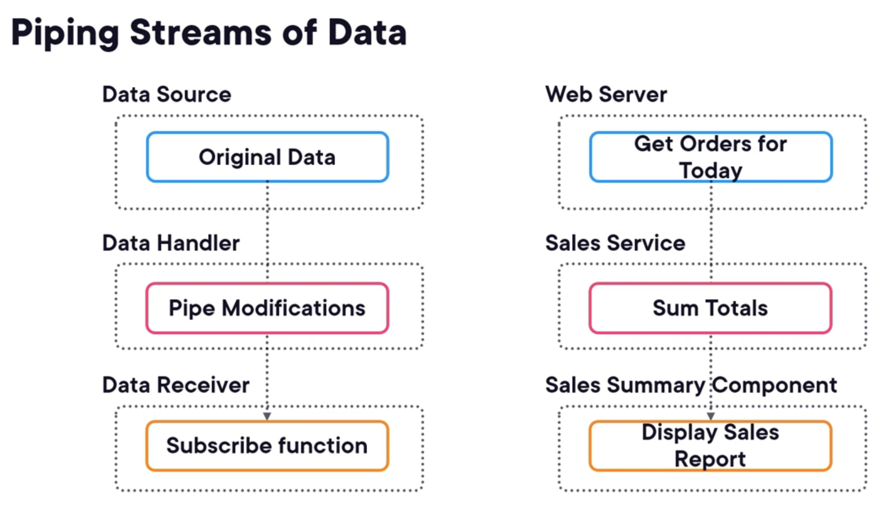

# Angular Fundamentals

Plural sight Course Link - https://app.pluralsight.com/library/courses/fundamentals-angular/table-of-contents

---

## Getting Started with Angular

- Angular Project is made up of Components and Services
- Component consists of HTML (template) and TS [Display logic]
- Service consists of TS [Business logic]
- Angular Modules : these are the group or parts of the application which can be loade as in need basis to have less things on-memory.
    
    
    
- TypeScript - a JS language that adds type safety to JS.
- Pre-requisites - node.js and AngularCLI
- Node.js - Engine that allows JS to run on system

---

## Creating Angular Components

- ng generate component comp_name
- **Application prefix-**
    
    In Angular applications, a prefix is a string that gets appended to the names of components, directives, and pipes when they are generated using the Angular CLI (Command Line Interface) commands such as `ng generate component`, `ng generate directive`, or `ng generate pipe`. This prefix helps in avoiding naming conflicts with existing or future HTML elements, attributes, and other identifiers.
    
- In line templates and style
- **Component lifecycle hooks-**
    - Input changes
    - Once

---

## Angular Template Syntax

- Angular interpolation-
    
    Basically, js can be used in html files. Ex- <h1> 2+2 = {{ 2 + 2 }} </h1>
    
- **Binding** to component data using-
    - Interpolation
        
        Ex- 
        
    - attribute binding
        
        Ex- 
        
    - function
        
        Ex- 
        
- Angular Directive
    
    They are like special HTML attributes that are only recognised by Angular.
    
    Ex- ngClass, ngIf, ngFor, etc
    
- Event Bindings
    - Use () to bind event from template to component.
    - Use [] to bind data from components to template.
- Handling Null values with the Safe navigation operator(?)
- Angular pipes
- We can format data using Angular pipe such as currency. Ex- {{ p.amount | currency }}

---

## Styling Angular Components

- CSS Encapsulation by angular- styles in a particular component will only be applied to that component and not to parent or child components.
- ngClass directive - used for conditional styling
- ngStyle directive - used for conditional styling

---

## Communicating between Angular Components

- @Input is used to tell that the child component is being passed an input from parent component.
- @Output is used to send the triggered event from the child component to parent component.

---

## Creating and using Angular Services

- Dependency Injection
- @Injectable decorator is used to denote a service class.
- Injecting a Service
    - Constructor injection
    - inject function

---

## Making HTTPS requests with Angular

- Observable - used in dealing with Asynchronous data
- Piping inputs -
    - It modifies the data from the data source before it can be used by receiver
    
    
    
- Creating Observables

- Set a proxy server
- ngOnInit()
- Making a GET and POST request

---

## Routing and Navigating with Angular

- Route parameters. Ex- “catalog/:name”
- Query parameters

---

## Creating Angular Forms

- 2 types of Angular forms-
    - Template-Drive forms (HTML Template)
    - Reactive forms (JavaScript)
- 2 way data binding can be done like this, [(ngModel)] = “propertName”
- Use (ngSubmit) to submit the form
- Validation in template driven forms using template variables Ex- #signInForm=”ngForm”
- Different angular in-built form validators. Ex- email, pattern, required, etc.
- Form controls and data types

---

## Organising Angular Applications with Modules

- Angular Modules : these are the group or parts of the application which can be loade as in need basis to have less things on-memory.

Main app module

- Types of Modules
    - Routing modules
    - Feature modules
- Lazy loading with modules

---

## Testing Angular Applications

- Type of tests-
    - Unit test
    - End-to-end tests
- Tools for running unit tests - Karma, Jest, Jasmine, Mocha.
- Tools for running end-to-end tests - Cypress

---

## What Next?

- Angular Best Practices course on Plural sight- https://app.pluralsight.com/library/courses/best-angular-practices/table-of-contents
- Reactive forms course on PluralSight
